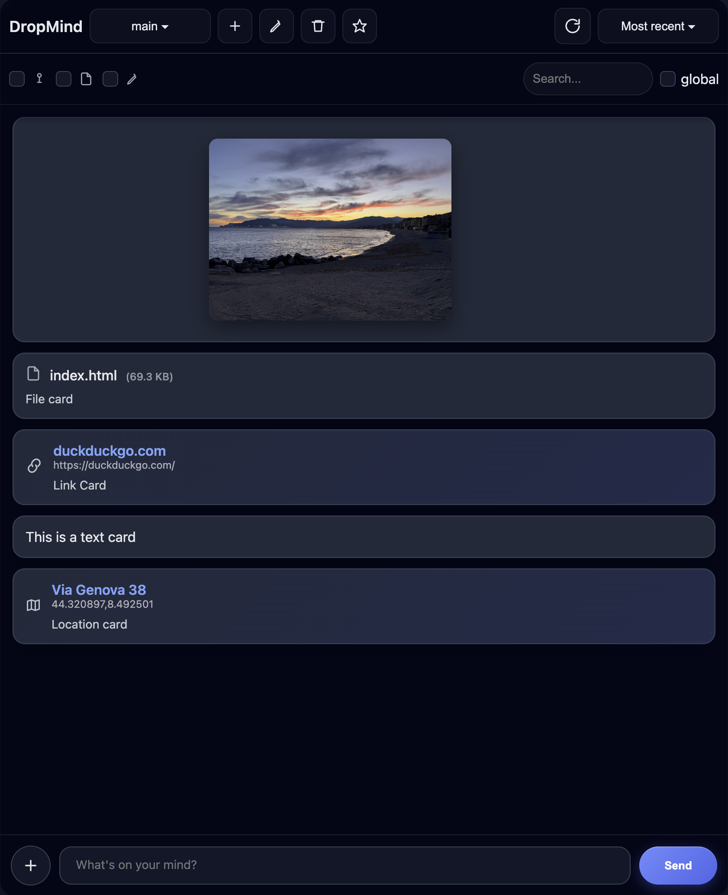
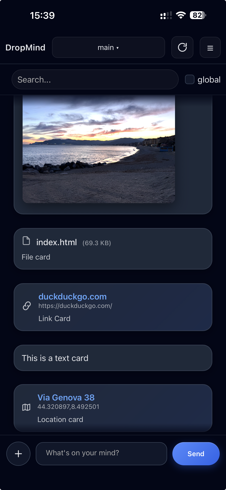

# DropMind


A lightweight **self-hosted capture layer** for links, notes, screenshots and files across your devices.

Most tools focus on organizing information.  
DropMind focuses on **capturing it instantly**, from anywhere.

**Drop something now. Organize it later.**

## The idea

DropMind is a personal capture inbox.

When you find something on one device and want to use it later on another,
just drop it into DropMind.

Phone → drop link / note / file  
DropMind → temporary inbox  
Desktop → review or archive

## 🌐 Works everywhere

DropMind is designed as a universal capture layer:

- iOS → via Shortcuts  
- Android → via Share system  
- Desktop → via bookmarklet  

Same backend. Same flow.

------------------------------------------------------------------------

📖 **Documentation:** https://github.com/oldany/dropmind/wiki

------------------------------------------------------------------------

💬 **How are people using DropMind?**

I'm curious how others are integrating DropMind into their workflows.

If you're trying it or already using it, feel free to share your setup or ideas in the discussion:

👉 [Join the discussion](https://github.com/oldany/dropmind/discussions/3)

------------------------------------------------------------------------

## ✨ What you can capture

DropMind is built for fast, frictionless capture.

You can quickly drop:

- links to read later
- screenshots from mobile
- temporary files between devices
- quick notes
- ideas or reminders

### Core capabilities

- simple message-style interface
- send **text, links, images and files**
- **multi-clipboard organization**
- global search
- installable **PWA** (mobile & desktop)
- **Android share support**
- **Apple Shortcut support for instant sharing**
- extremely lightweight
- **Docker deployment**

------------------------------------------------------------------------

💡 **Ideas or feedback welcome**

DropMind is intentionally minimal and focused on doing one thing well: capturing things quickly.

If you have ideas, workflow suggestions, or integrations that could make it more useful, feel free to open an issue or join the discussion.

👉 [Join the discussion](https://github.com/oldany/dropmind/discussions/3)

------------------------------------------------------------------------

## 📸 Screenshots

### Desktop



### Mobile



------------------------------------------------------------------------

## 🍎 Apple Shortcut

DropMind can integrate with **Apple Shortcuts** to quickly send:

-   links
-   text
-   images
-   files

directly from **iOS and iPadOS**.

This makes DropMind behave like a **personal cross‑device inbox**.

### Install the Shortcut

👉 **Download here:**  
[Add DropMind Shortcut](https://www.icloud.com/shortcuts/7e7c85fdd6a642058ca5cd0d76d69cd9)

After installation:

1. Open the Shortcut once to grant permissions  
2. Set your DropMind server URL  
3. Insert your API token  
4. Choose your default clipboard  

You're ready.

Fully local. Fully yours.

------------------------------------------------------------------------

## 🌐 Bookmarklet

DropMind lets you capture anything from the web in one click.

- select text → save instantly  
- no selection → save page (title + URL)  
- optional note when needed  

Works in any browser. No extensions. No accounts.

👉 Setup and full instructions:  
https://github.com/oldany/dropmind/wiki/Sharing%E2%80%90to%E2%80%90DropMind

------------------------------------------------------------------------

## 💡 Typical Workflow

1.  Find something interesting on your phone
2.  **Drop it into DropMind**
3.  Later open it on your computer
4.  Keep it, move it elsewhere, or delete it

DropMind is **not a note‑taking system**.

It is a **temporary capture space** for your digital thoughts.

Use it as the **front door for your ideas and resources**.

------------------------------------------------------------------------

## 🚀 Quick Start

Clone the repository:

``` bash
git clone https://github.com/oldany/dropmind
cd dropmind
```

Start the stack:

``` bash
docker compose up -d
```

Create a `config.js` file inside the `frontend` folder:

``` js
window.DM_CONFIG = {
  API_BASE_URL: "http://localhost:8000",
  API_TOKEN: "your-secure-token"
};
```

If running behind HTTPS (reverse proxy), use `https://` for the API URL.

Open your browser:

    http://localhost:8080

That's it.

------------------------------------------------------------------------

## 🐳 Deploy with Prebuilt Docker Images (Recommended)

DropMind provides official multi-architecture Docker images (amd64 +
arm64) published on GitHub Container Registry.

This is the recommended way to deploy in production.

### Backend

``` bash
docker pull ghcr.io/oldany/dropmind-backend:latest
```

### Frontend

``` bash
docker pull ghcr.io/oldany/dropmind-frontend:latest
```

------------------------------------------------------------------------

### Example docker-compose (Production)

``` yaml
version: "3.9"

services:
  backend:
    image: ghcr.io/oldany/dropmind-backend:latest
    container_name: dropmind_backend
    volumes:
      - ./data/db:/data/db
      - ./data/attachments:/data/attachments
    ports:
      - "8000:8000"
    environment:
      - DROPMIND_API_TOKEN=your-secure-token
    restart: unless-stopped

  frontend:
    image: ghcr.io/oldany/dropmind-frontend:latest
    container_name: dropmind_frontend
    volumes:
      # Optional: external config.js
      - ./frontend/config.js:/usr/share/nginx/html/config.js
    ports:
      - "8080:80"
    depends_on:
      - backend
    restart: unless-stopped
```

------------------------------------------------------------------------

### 🔐 config.js Example

Create a `config.js` file inside the `frontend` folder:

``` js
window.DM_CONFIG = {
  API_BASE_URL: "http://localhost:8000",
  API_TOKEN: "your-secure-token"
};
```

If running behind HTTPS (reverse proxy), use `https://` for the API URL.

------------------------------------------------------------------------

⭐ If you like DropMind, consider starring the repo to support the project!

------------------------------------------------------------------------

## 🧠 Philosophy

Your thoughts are personal.\
Your memory system should be too.

Many people use:

-   Telegram "Saved Messages"
-   email
-   cloud notes

to move things between devices.

DropMind provides a **self‑hosted alternative focused on quick
capture**.

Simple. Private. Always available.

------------------------------------------------------------------------

## 🤖 Human + AI Development

DropMind was created by a human with the assistance of AI tools.

AI helped accelerate development, but the **idea, direction and design
decisions were human‑driven**.

------------------------------------------------------------------------

## 🛣 Roadmap

DropMind is developed in my free time, primarily to solve my own personal workflow needs.

Because of this, there are no fixed timelines or guaranteed features.
Development happens when time and ideas align.

That said, these are some areas and ideas I would like to explore in the future:

### Capture & workflow improvements

- Multi-select actions (move / delete multiple items)
- Temporary clipboards with automatic expiration
- ~~Faster quick-capture shortcuts~~ — Done
- Improved link parsing and smart cards

### Integrations
- API / webhook ingestion for external tools
-  Automation integrations (Shortcuts, scripts, etc.)
- ~~Lightweight bookmarklet for quick capture from the browser~~ - Done

### UI improvements
- Drag & drop support for desktop uploads
- Live drop / quick file capture
- ~~Additional keyboard shortcuts and small UX improvements~~ — Done

### Architecture
At some point the frontend will likely be refactored to split the current single index.html into smaller modular files to make the codebase easier to maintain.

------------------------------------------------------------------------

## Why AGPL?

To ensure that DropMind remains open if modified and offered as a public
service.
To prevent closed commercial forks of DropMind while keeping the project
fully open.

------------------------------------------------------------------------

## 📜 License

DropMind is licensed under the GNU Affero General Public License v3.0
(AGPL-3.0).

You are free to use, modify and self-host it.

If you modify DropMind and deploy it publicly, you must release your
changes under the same license.

------------------------------------------------------------------------

## Support

DropMind is developed in spare time.

If you find it useful, you can support development:

☕ https://ko-fi.com/oldany

------------------------------------------------------------------------

## 🌊 Drop it. Own it. Move on.
